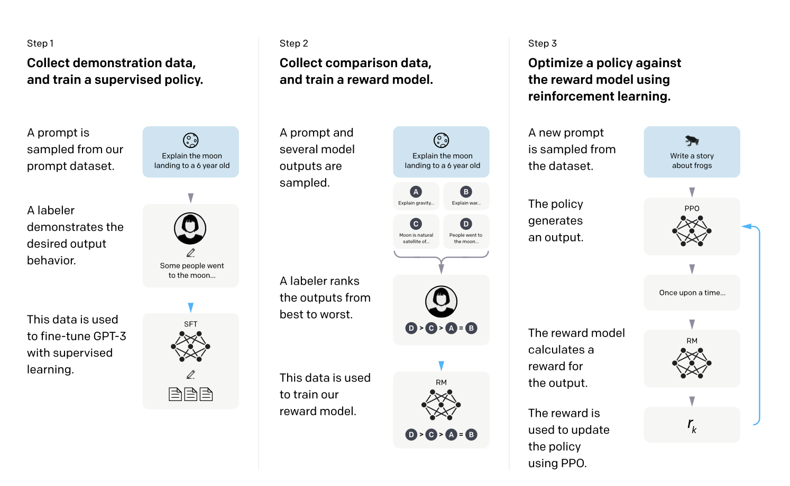

# Training Language Models to Follow Instructions with Human Feedback

#### a paper by Long Ouyang, Jeff Wu, Xu Jiang, Diogo Almeida, Carroll L. Wainwright, Pamela Mishkin, Paul Christiano, Jan Leike, Ryan Lowe, and the OpenAI Alignment team
___
## Table of Contents
|Section| Description                  |
|:---|:-----------------------------|
|[Introduction](#introduction)| Motivation and Goal of the Paper |
|[Approach](#approach)| How the Authors Achieved Their Goal|
|[Critical Analysis](#critical-analysis)| Strengths and Weaknesses of the Paper|
|[Discussion Questions](#discussion-questions)| Questions to Consider for Discussion|
|[Other Resources](#other-resources)| Related Papers, Links, Videos|

___

Introduction
---
### Motivation
Large language models like GPT-3 are adaptable to many downstream tasks via prompting, but can exhibit unintended behaviors when deployed, such as toxicity, bias, and misinformation. This happens because their objective of predicting the next token does not align with objectives like being **helpful, honest, and harmless**.

### Goal
The authors aim to address this mismatch and improve the alignment of large language models with human intentions. Their goal is to modify model behavior to be more helpful, truthful, and harmless when following instructions. This is an important step towards safer deployment of capable language models.

___

Approach
---

___

Architecture
---
#### Pseudocode

###### Step 1: Collect Dataset of Human Demonstrations
Collect dataset of human demonstrations \(D_{\text{demos}}\).

##### Step 2: Initialize Supervised Policy
Initialize supervised policy \(\pi_{\text{SL}}\) by fine-tuning a language model on \(D_{\text{demos}}\).

##### Step 3: Collect Dataset of Human Comparisons
Collect dataset of human comparisons \(D_{\text{comps}}\) between model outputs.

##### Step 4: Train Reward Model
Train the reward model \(R(x, y)\) on \(D_{\text{comps}}\).

##### Step 5: Initialize PPO Policy
Initialize the PPO policy \(\pi_{\text{PPO}}\) from \(\pi_{\text{SL}}\).

##### Step 6: Initialize Value Function
Initialize the value function \(V(x)\) from \(R(x, y)\).

##### Step 7: PPO Iterations
For each PPO iteration:
1. Sample prompts \(x \sim D\).
2. Generate outputs \(y \sim \pi_{\text{PPO}}(x)\).
3. Calculate rewards \(r = R(x, y)\).
4. Compute the loss:
   \[
   L = \sum_t \gamma^t R(x_t, y_t) - \text{KL}[\pi_{\text{PPO}}(y_t | x_t) || \pi_{\text{SL}}(y_t | x_t)]
   \]
5. Update \(\pi_{\text{PPO}}\) with \(\nabla L\).

## Step 8: Deploy Final Policy
Deploy \(\pi_{\text{PPO}}\) as the final policy.

---

### Key Changes
- \(D_{\text{demos}}\): Dataset of human demonstrations
- \(\pi_{\text{SL}}\): Supervised learning policy
- \(D_{\text{comps}}\): Dataset of human comparisons
- \(R(x, y)\): Learned reward model
- \(\pi_{\text{PPO}}\): Final PPO policy

Results
---

___
Critical Analysis
---

___
Discussion Questions
---

Other Resources
---
- [Play around with InstructGPT in the OpenAI Playground*](https://platform.openai.com/playground?mode=complete)
- [InstructGPT Video with One of the Authors](https://www.youtube.com/watch?v=QGpaBWOaHQI)
- [OpenAI InstructGPT Repo with Model Card and Samples](https://github.com/openai/following-instructions-human-feedback#instructgpt-training-language-models-to-follow-instructions-with-human-feedback)
- [OpenAI Paper Summary](https://openai.com/research/instruction-following#sample1)
- [HuggingFace RLHF Blog Post](https://huggingface.co/blog/rlhf)
- [For More on PPO - from OpenAI](https://openai.com/research/openai-baselines-ppo)
- [For More on RLHF - from OpenAI](https://openai.com/research/learning-from-human-preferences)

*Note: You need to make an OpenAI account to access the Playground.
___
Citation for this Paper:\
Ouyang, L., Wu, J., Jiang, X., Almeida, D., Wainwright, C., Mishkin, P., ... & Lowe, R. (2022). _Training language models to follow instructions with human feedback_. Advances in Neural Information Processing Systems, 35, 27730-27744.
