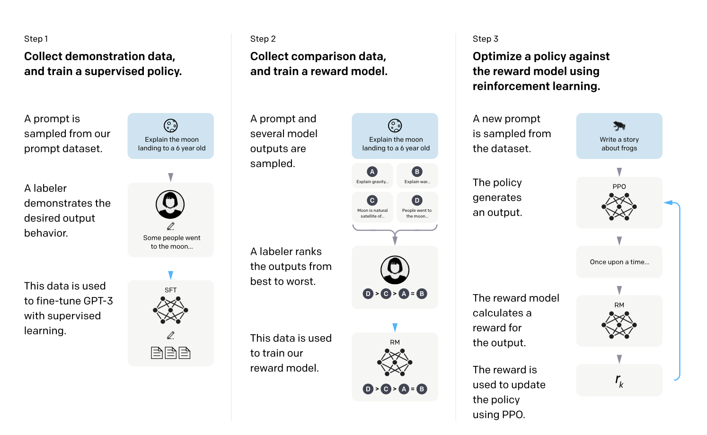
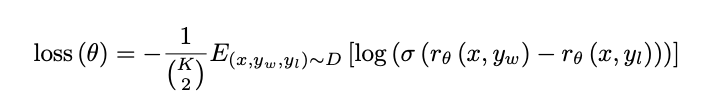
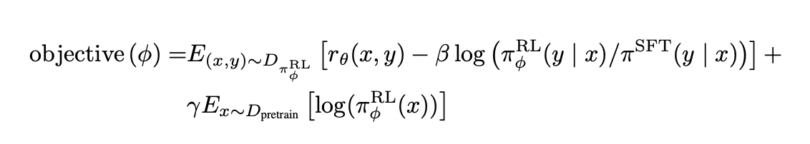
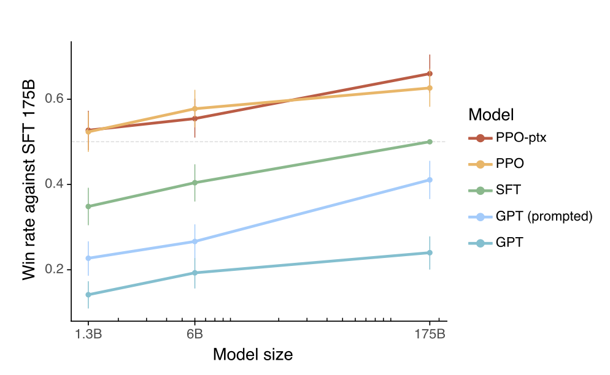
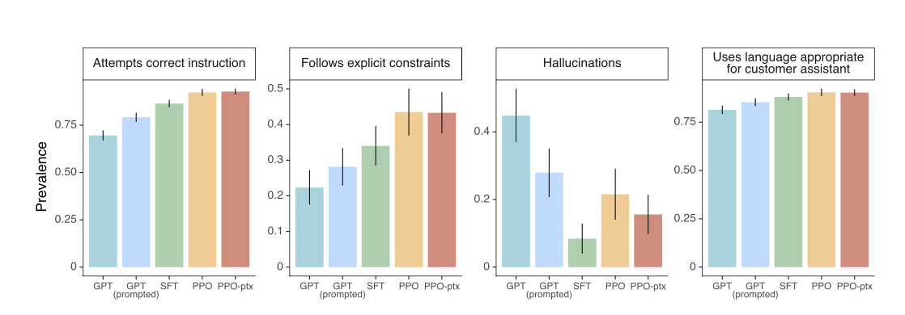

# Training Language Models to Follow Instructions with Human Feedback

#### a paper by Long Ouyang, Jeff Wu, Xu Jiang, Diogo Almeida, Carroll L. Wainwright, Pamela Mishkin, Paul Christiano, Jan Leike, Ryan Lowe, and the OpenAI Alignment team
___
## Table of Contents
| Section                                       | Description                          |
|:----------------------------------------------|:-------------------------------------|
| [Introduction](#introduction)                 | Motivation and Goal of the Paper     |
| [Approach](#approach)                         | How the Authors Achieved Their Goal  |
| [Critical Analysis](#critical-analysis)       | Analysis of the Paper                |
| [Discussion Questions](#discussion-questions) | Questions to Consider for Discussion |
| [Other Resources](#other-resources)           | Related Papers, Links, Videos        |

___

Introduction
---
### Motivation
Large language models like GPT-3 are adaptable to many downstream tasks via prompting, but can exhibit unintended behaviors when deployed, such as toxicity, bias, and misinformation. This happens because their objective of predicting the next token does not align with objectives like being **helpful, honest, and harmless**.

### Goal
The authors aim to address this mismatch and improve the alignment of large language models with human intentions. Their goal is to modify model behavior to be more helpful, truthful, and harmless when following instructions. This is an important step towards safer deployment of capable language models. They create a model called InstructGPT.

___

Approach
---

### High Level - Step by Step
1. The model is pretrained on a large dataset of text. (This is what we have with GPT-3.)
2. The model is fine-tuned on a dataset of instructions and completions. (Bootstrapping Step)
3. Create Reward Model:
    - For a subset of instructions, generate multiple completions using the fine-tuned model and have humans rank them.
    - Train the reward model to predict the quality of completions.
4. Use Reinforcement Learning to update the model using PPO (Proximal Policy Optimization).
    - Sample a batch of instruction, completion pairs.
    - Use the reward model to assign rewards to the completions.
    - Optimize the model's parameters to maximize the expected reward.
5. Repeat steps 3 and 4 until you are happy with results.
6. Deploy the model!

### Reward Model
The main part of RLHF starts with the second step in the diagram above. The authors use a reward model to evaluate the model's behavior. The reward model is trained to predict whether a model's behavior is helpful, honest, and harmless and is based off hired human labelers.

Labelers are given responses to a corresponding prompt and asked to rank them.
This creates the following loss function for the reward model:

| Term       | Definition |
|------------|------------|
| `r_θ(x,y)` | The scalar output of the reward model for prompt `x` and completion `y` with parameters `θ`. |
| `y_w`      | The preferred completion out of the pair of `y_w` and `y_l`. |
| `D`        | The dataset of human comparisons. |

By using this loss function, the reward model is trained to predict which of two completions is more helpful, honest, and harmless. The reward model is then used to evaluate the model's behavior.

### Reinforcement Learning
Now that we have defined the reward model, we can do reinforcement learning to train the model to follow instructions. The model is trained to maximize the expected reward of the reward model. This is done by using the reward model to evaluate the model's behavior and then using the reward to update the model's parameters.
The reinforcement learning is done through the following objective function.

| Term         | Definition                                                                                                        |
|--------------|------------------------------------------------------------------------------------------------------------------|
| `πRL`        | The learned RL (Reinforcement Learning) policy.                                                                   |
| `πSFT`       | The supervised trained model.                                                                                     |
| `D_pretrain` | The pretraining distribution.                                                                                     |
| `β` (beta)   | The KL (Kullback-Leibler) reward coefficient, controlling the strength of the KL penalty.                         |
| `γ` (gamma)  | The pretraining loss coefficient, controlling the strength of the pretraining gradients.                         |

___
Results
---
The following diagrams from the paper show promising results from the evaluation of the model RLHF models (PPO, PPO-ptx) against other models.

This one shows the pure performance of models across parameter sizes.

This one shows the alignment focused evaluations of the models.

___
Critical Analysis and Key Takeaways
---
### Key Takeways
- We can get excellent performance with less training data and less compute by using RLHF.
- Models can still be generalizable if pretraining data is mixed into the reinforcement learning.
- RLHF can be used to improve the alignment of models with human intentions.
- We can have smaller models which perform better than larger models by using RLHF.

### Critical Analysis
- The alignment of a model depends on the preferences of the labeler population.
- The results show that helpfulness gets better with RLHF, but safety is still mostly unexplored.

___
Discussion Questions
---
### Question 1: Explore the ethical implications of using human feedback in the training process. What are the potential risks and benefits?
### Question 2: How can we try to ensure that models are aligned correctly to a population with RLHF?

Other Resources
---
- [Play around with InstructGPT in the OpenAI Playground*](https://platform.openai.com/playground?mode=complete)
- [InstructGPT Video with One of the Authors](https://www.youtube.com/watch?v=QGpaBWOaHQI)
- [OpenAI InstructGPT Repo with Model Card and Samples](https://github.com/openai/following-instructions-human-feedback#instructgpt-training-language-models-to-follow-instructions-with-human-feedback)
- [OpenAI Paper Summary](https://openai.com/research/instruction-following#sample1)
- [HuggingFace RLHF Blog Post](https://huggingface.co/blog/rlhf)
- [For More on PPO - from OpenAI](https://openai.com/research/openai-baselines-ppo)
- [For More on RLHF - from OpenAI](https://openai.com/research/learning-from-human-preferences)

*Note: You need to make an OpenAI account to access the Playground.
___
Citation for this Paper:\
Ouyang, L., Wu, J., Jiang, X., Almeida, D., Wainwright, C., Mishkin, P., ... & Lowe, R. (2022). _Training language models to follow instructions with human feedback_. Advances in Neural Information Processing Systems, 35, 27730-27744.
